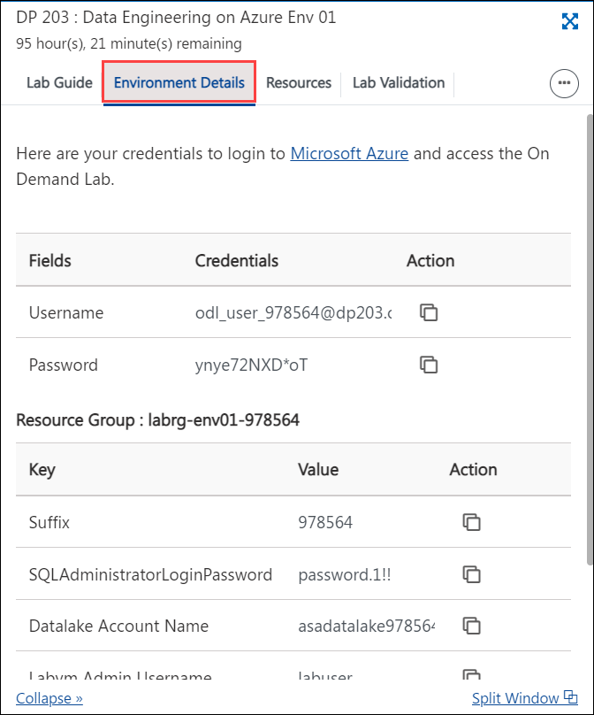
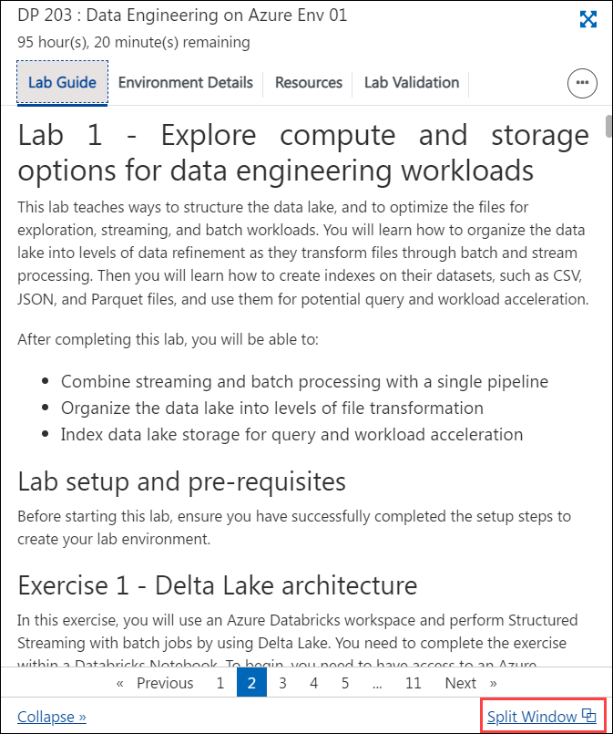
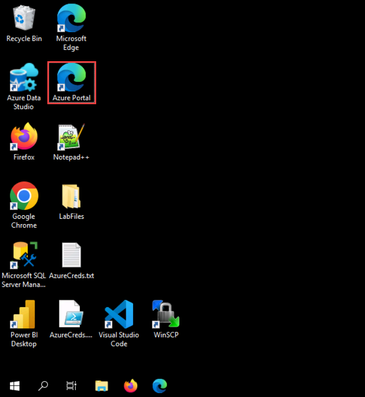
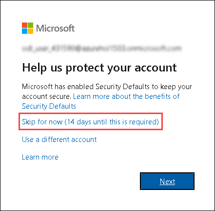
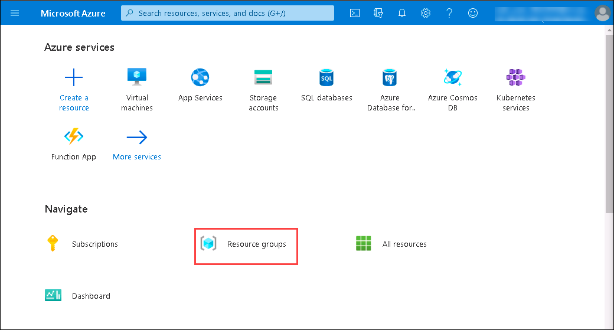
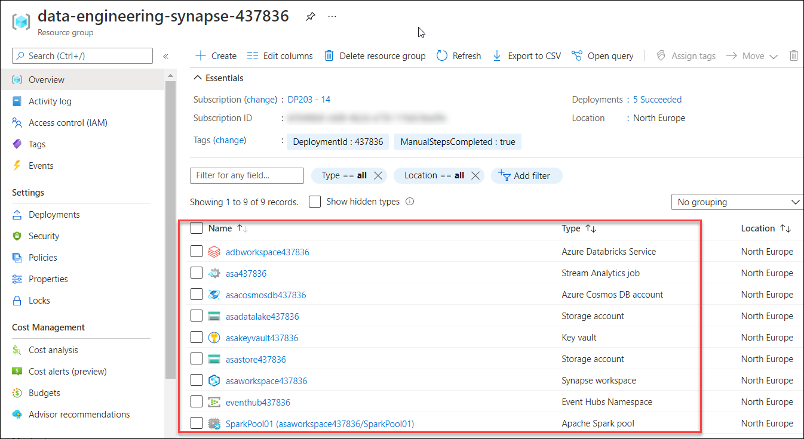
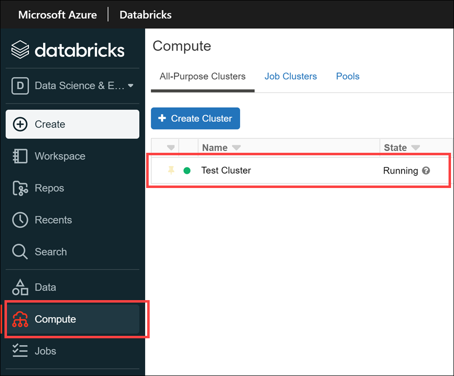
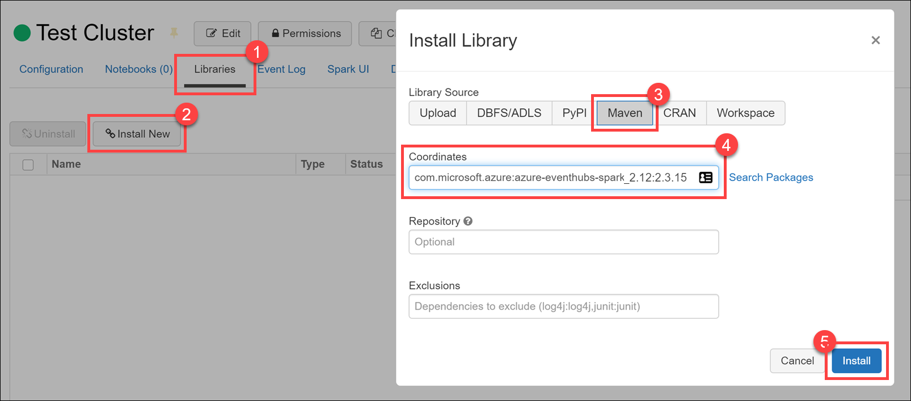

## **Getting Started**

1. Once the environment is provisioned, a virtual machine and lab guide will get loaded into your browser. Use this virtual machine throughout the workshop to perform the lab.
   
   
   
1. To get the lab environment details, you can select the Environment Details tab. Additionally, the credentials will also be sent to your email address provided during registration.

   

1. You can also open the Lab Guide on a separate full window by selecting the **Split Window** button on the bottom right corner.

   

### Log in to the Azure portal and verify the pre-deployed resources

1. In the LabVM, double-click on the **Azure portal** shortcut on the desktop.

     
     
1. On the **Sign in to Microsoft Azure** blade, you will see a login screen, in that enter the following email/username and then click on **Next**.  
   
   * **Azure Username/Email**:  <inject key="AzureAdUserEmail"></inject>
   * **Azure Password**:  <inject key="AzureAdUserPassword"></inject>
  
1. If you see the pop-up below, click **Skip for now(14 days until this is required)**.

   

1. If you see the pop-up  **Stay Signed in?**, click **No**.

1. If you see the pop-up **You have free Azure Advisor recommendations!**, close the window to continue the lab. 

1. If a **Welcome to Microsoft Azure** popup window appears, click **Maybe Later** to skip the tour.

1. Now you can see the Azure Portal Dashboard, click on **Resource groups** from the Navigate panel to see the resource groups.
  
     
     
1. Navigate to the **data-engineering-synapse-<inject key="DeploymentID" enableCopy="false"/>** Resource group and verify whether you have all the below resources deployed successfully.
  
      

   - Azure Databricks Service
   - Stream analytics job
   - Azure Cosmos DB
   - Two Storage Accounts
   - Key vault
   - Synapse workspace
   - Event hub namespace
   - Apache spark pool
  
1. Click on **Next** from the bottom right corner and follow the instructions to perform the lab.

   >**Note:** Please perform these steps before performing **lab 11**.

1. In the left-hand navigation menu of your Databricks workspace, select Compute, then select your cluster in the list. If it's not running, start it now.
   
    
   
1. Select the Libraries tab (1), then select Install New (2). In the Install Library dialog, select Maven under Library Source (3). Under Coordinates, paste com.microsoft.azure:azure-eventhubs-spark_2.12:2.3.15 (4), then select Install.

     

1. Wait until the library successfully installs before continuing
  
     

## Modules Included

  In this hands-on lab, you will be performing the below modules:

- **Module 01: Explore compute and storage options for data engineering workloads**  
- **Module 03: Data Exploration and Transformation in Azure Databricks**
- **Module 04: Explore, transform, and load data into the Data Warehouse using Apache Spark**
- **Module 05: Ingest and load data into the data warehouse**
- **Module 06: Transform data with Azure Data Factory or Azure Synapse Pipelines**
- **Module 07: Integrate data from Notebooks with Azure Data Factory or Azure Synapse Pipelines**
- **Module 08: End-to-end security with Azure Synapse Analytics**
- **Module 09: Support Hybrid Transactional Analytical Processing (HTAP) with Azure Synapse Link**
- **Module 10: Real-time Stream Processing with Stream Analytics**
- **Module 11: Create a Stream Processing Solution with Event Hubs and Azure Databricks**
 
